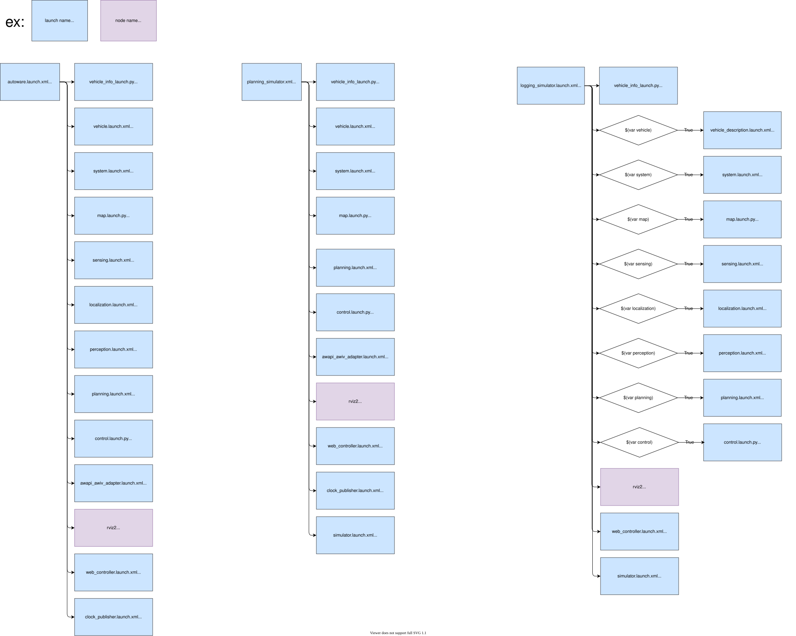

# autoware_v2_launch

## Structure



## Package Dependencies

Please see `<exec_depend>` in `package.xml`.

## Usage

You can use the command as follows at shell script to launch `*.launch.xml` in `launch` directory.

```bash
ros2 launch autoware_v2_launch autoware.launch.xml map_path:=/path/to/map_folder vehicle_model:=lexus sensor_model:=aip_xx1
```
